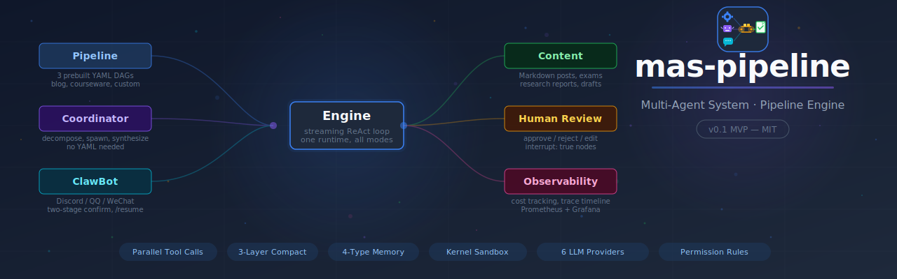
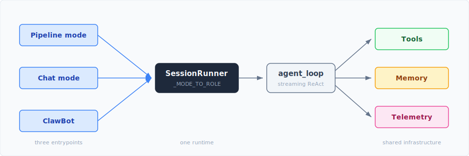
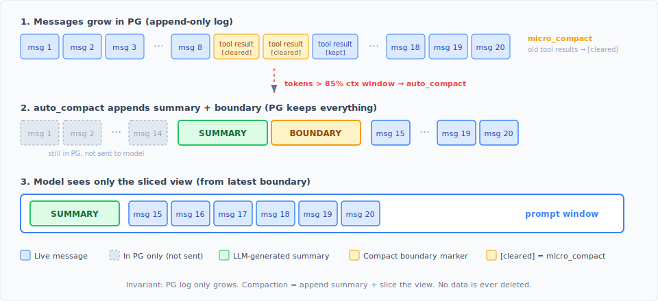
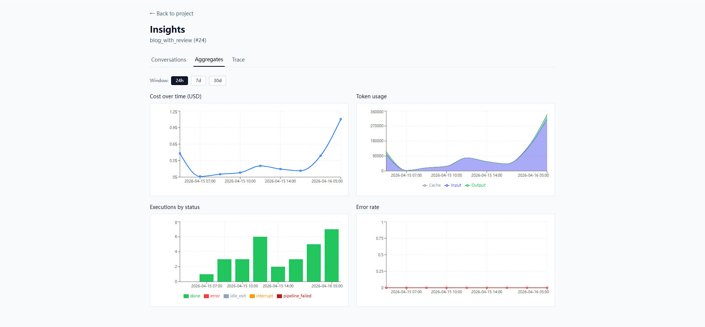
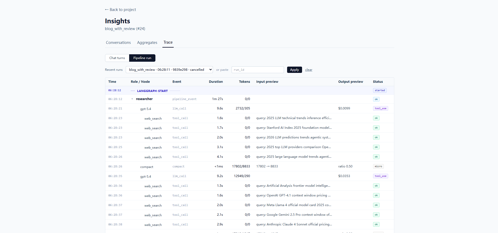
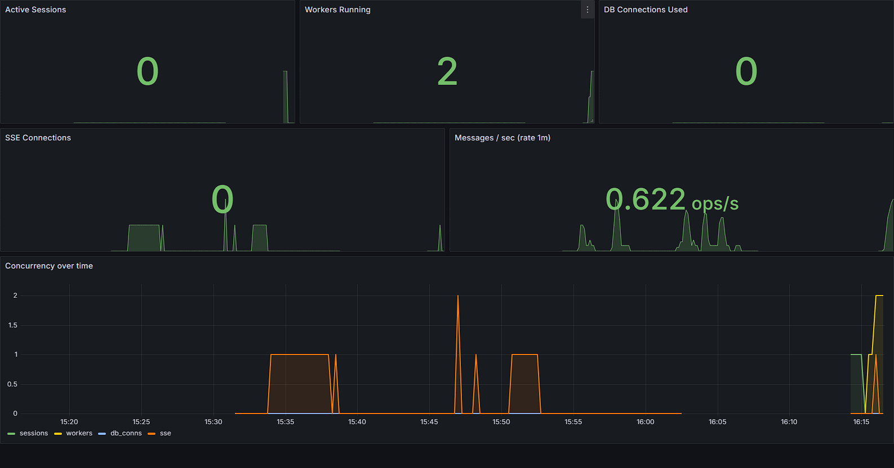

# mas-pipeline

[English](README.md) | **中文**

> **状态：v0.1 — MVP（2026-04-14）** · 免费开源，学习性质为主 · docker 一键栈 + REST + Web UI + 群聊 Bot 端到端打通

一个可配置的多 Agent 系统引擎，专为内容生产管线而生。Agent 是 Markdown 文件，管线是 YAML DAG，同一套工作流可以以三种方式运行 —— 批处理管线、聊天会话、群聊机器人 —— 三种入口之间没有胶水代码。



---

## v0.1 — MVP 功能清单

首个打标签发布。引擎、REST API、Web UI、docker 栈、群聊网关全部端到端打通，可以通过集成冒烟测试。

**Agent 运行时** —— 流式 ReAct 循环 · 多厂商路由（Anthropic / OpenAI / Gemini / DeepSeek / Qwen / Ollama）· 仅追加式上下文压缩 + 熔断器 · **单轮内并行工具调用** · 11 个内置工具 · `spawn_agent` 拉起隔离转录的子 Agent · Markdown 定义的 Skill · 项目级持久化 Memory。

**管线引擎** —— YAML DAG，依据 `input` / `output` 名称推断依赖 · 编译为 LangGraph 1.x 并以 Postgres 做 checkpointer · `interrupt: true` 节点支持人工审核（通过 / 驳回带反馈 / 编辑输出）· 子串匹配的分支路由。

**同一管线三种执行模式** —— 批处理管线运行 · 普通聊天 · 自主聊天（`coordinator` 通过 `spawn_agent` 拆解派发）· ClawBot 群聊（Discord / QQ / WeChat）带意图路由与两阶段确认。

**数据与检索** —— 多模态 RAG（PDF / PPTX / DOCX / 图片）落地 pgvector · 默认本地 Ollama 向量模型，零云端密钥 · Embedder 离线时服务器仍可启动并优雅降级。

**安全** —— 拒绝列表权限规则覆盖每一次工具调用 · `ShellTool` 的内核沙箱（`bubblewrap` / `sandbox-exec`）· `PreToolUse` / `PostToolUse` / `UserPromptSubmit` 钩子点。

**Web UI** —— React 18 + Tailwind SPA，7 个页面：项目总览、带来源徽章的分层 agent / pipeline / run 标签页、带思考块和子 Agent 抽屉的聊天页、DAG 编辑器（Monaco YAML ↔ React Flow 双向同步）、带中断审核的 run 详情页、可观测性时间线。

**部署** —— 一条 `docker compose up` 拉起整个栈 · 可选 Prometheus + Grafana profile · 5 个 Prometheus 指标 · 启动时强制单 worker 不变量。

**v0.1 之外推迟的事项：** 多 worker 粘性路由、DB 索引调优、跨重启的会话恢复。

---

## 产品速览

从用户视角快速看一遍系统到底能做什么 —— 三种入口、每种入口在浏览器里长什么样，以及这些页面是怎么串起来的。

https://github.com/user-attachments/assets/ec2f93ca-2f2c-4dd5-9749-c22bbe2629c6

[▶ 在 Bilibili 观看完整版](https://www.bilibili.com/video/BV1Nzd8BeEuF)

### 项目是一切的起点

所有东西都装在**项目**里：一个容器，持有源材料、默认管线、运行历史和一个作用域化的 Memory 仓。你从 `ProjectsPage` 总览页创建项目，丢进 PDF / PPTX / DOCX / Markdown，RAG 层（`src/rag/`）会把它们切片、向量化写入 pgvector。`ProjectDetailPage` 接着展开成若干 Tab —— `dashboard / pipeline / agents / runs / files / chat / observability` —— 一个 URL 就够你看完、驱动完一个工作体的全部事务。



下面三种驱动方式共享同一个 `SessionRunner`（`_MODE_TO_ROLE = {"chat": "assistant", "autonomous": "coordinator", "bus_chat": "clawbot"}`）、同一个工具编排器、同一个遥测采集器、同一张项目级 Memory 表。没有第二条运行时路径 —— 三种驱动只是一条循环上的三个入口。

### 驱动 1 —— 管线模式：可暂停、可审批的 DAG 运行

头牌驱动。一条管线是 `pipelines/` 下的一个 YAML 文件，列出一组节点；`src/engine/pipeline.py::load_pipeline` 解析 YAML，依据 `input` / `output` 名称匹配推断依赖（用 Kahn 算法检测环），`src/engine/graph.py` 将它编译为 LangGraph，用 `AsyncPostgresSaver` 作为 checkpointer。每个节点是一次 agent 轮次，事件实时流式输出。

**暂停与审核机制到底是怎么跑的。** 任何打上 `interrupt: true` 的节点，在编译期会被拆成两个 LangGraph 节点 —— `{name}_run` 与 `{name}_interrupt`。`{name}_run` 结束后，interrupt 节点调 LangGraph 的 `interrupt({node, output})` 原语，该调用会暂停 run 并把完整状态存进 checkpointer。run 行翻转到 `status=paused`，API 暴露 `paused_at` + `paused_output` 两个字段。审阅人接着向 `/runs/{run_id}/resume` 发起请求，三种动作之一：

| 动作 | 载荷 | 效果 |
|---|---|---|
| `approve` | 裸字符串或 `{action: "approve"}` | 从暂停的节点继续运行，保留原输出不变 |
| `reject` | `{action: "reject", feedback: "..."}` | 带着驳回理由继续运行，下游 agent 看得到这段反馈 |
| `edit` | `{action: "edit", edited: "..."}` | 用审阅人的替换文本覆盖该节点的输出再继续 |

`resume_pipeline` 通过 `checkpointer.aget(config)` 加载 checkpoint，重建图，然后用 `Command(resume=feedback)` 重新调用。没有轮询、没有状态重建 —— LangGraph 的持久化层把重活都包了。

**你在浏览器里会看到什么。** `RunDetailPage.tsx` 是所有这些浮出水面的地方。一个彩色状态徽章（`running / paused / completed / failed / cancelled`）在上方，下面是一个 **RunGraph** 组件，把管线画成一张实时的 DAG —— 每个 agent 跑完，对应节点方块就填色。点任何节点都会唤起 **RunNodeDrawer**，里面有这个 agent 的完整对话、工具调用、token / 成本统计。节点处于 paused 状态时，抽屉里会多出三个按钮 —— approve、reject、edit —— 其中 `edit` 会弹出一个 Monaco 编辑器，预填好暂停输出，审阅人可以就地改写。页面始终保持一条 **SSE 连接**到 `/projects/{pid}/pipelines/{name}/runs?stream=true`，所以 `pipeline_start / node_start / node_end / pipeline_paused / pipeline_end` 事件一发生就会填到时间线上（15 秒心跳，慢消费者按 drop-oldest 丢）。

**编写管线。** `PipelineEditorPage.tsx` 是写新工作流的地方。左侧是管线列表，带克隆 / 新建按钮；右侧是 **Monaco YAML 编辑器**和 **PipelineGraph** 画布（React Flow + dagre 布局）并排显示，把解析后的 YAML 渲染成可读的 DAG。作者改 YAML，其他所有人读图。

**并肩的 Assistant 助手。** 每个项目都配了一个聊天页面，由一个只读的 `assistant` agent（`agents/assistant.md`，`model_tier: light`，`readonly: true`，`entry_only: true`，`max_turns: 8`）坐镇。它不是来生成内容的，它是来回答关于项目本身的问题的。它的工具箱故意做得很窄 —— `get_current_project`、`list_project_runs`、`get_run_details`、`search_docs`（对已上传材料做 RAG）、`web_search` 作为兜底，以及 `memory_read` / `memory_write`。你可以问它 *"run #42 的结论是什么？"* 或者 *"上传的那份课件里第几章讲了注意力头？"*，它会替你走一遍项目状态。因为它是 `entry_only`，不能被当作子 Agent 拉起；因为它是 `readonly`，也绝不会在回答问题的时候顺手开一个新 pipeline run。

### 驱动 2 —— 自主聊天：Coordinator 替你派发子 Agent

第二种驱动是同一个 `ChatPage.tsx`，只是**模式下拉从 `chat` 切到了 `autonomous`**。URL、会话模型、SSE 流 —— 都一样；变的只是角色：`_MODE_TO_ROLE["autonomous"] = "coordinator"`。对话现在背后挂的是 `agents/coordinator.md` —— `model_tier: strong`，`entry_only: true`，工具白名单里除了助手那套项目查询工具，额外多了 **`spawn_agent`**。

Coordinator 的职责是把一句自然语言的请求拆开、派发给一组专业子 Agent、再把结果缝合起来。比如 *"写一篇 1500 字关于 HTTP/3 多路复用的文章，再让审阅员把事实核一遍"* —— Coordinator 会调 `spawn_agent(role="researcher", task_description=...)`，调用**立即返回**一个 `agent_run_id`，researcher 则在后台任务里跑。researcher 跑完后，它的结果会以一段 XML `<task-notification>` 块的形式送回到 Coordinator 的会话里（隔离不变量见后文"幕后" → 子 Agent 小节）。Coordinator 读完通知，再基于这份调研派发一个 writer，读完写作成果再派发一个 reviewer。每个子运行在聊天里显示为一张 task-notification 卡片；点一下就会打开 **AgentRunDetailDrawer**，里面是子 Agent 的完整对话、按角色上色的消息行、以徽章形式呈现的每轮次统计 —— 你可以钻进协作细节而不把主线程塞满。

你拿到了一条管线的多 Agent 协作故事，却不必先写 YAML；等到某个模式变成可复用的形态，就可以把它提炼成一个真正的 `pipelines/*.yaml` 文件。

### 驱动 3 —— ClawBot：同一个引擎进驻 Discord / QQ / WeChat

第三种驱动把整套东西推到群聊房间里。`src/bus/gateway.py` 托管一个**网关服务**（在 `docker-compose.yml` 里是独立容器）；进来的消息落到 `Gateway.process`，按 `channel + chat_id` 匹配到会话，通过 `append_message` 追加到 Conversation，并以 `mode=bus_chat` 唤醒一个 `SessionRunner`。角色解析为 `clawbot`（`agents/clawbot.md`，`model_tier: strong`），它在共享工具池之上额外拥有一套**11 个网关工具**：

| 工具 | 作用 |
|---|---|
| `list_projects` | 列出当前群聊可见的项目 |
| `get_project_info` | 一个项目的名称、管线、文档数、最近一次 run |
| `search_project_docs` | 限定到某个项目的 RAG 搜索 |
| `start_project_run` | 两阶段确认的**第 1 阶段** —— 把一次待确认的 run 放入 `PendingRunStore`（10 分钟 TTL，单槽） |
| `confirm_pending_run` | **第 2 阶段** —— 读出 pending 槽位，建 `workflow_runs` 行，后台拉起执行 |
| `cancel_pending_run` | 还没 fire 之前丢弃 pending 槽位 |
| `cancel_run` | 终止一个已经在跑或暂停中的 run |
| `get_run_progress` | 查询实时状态 / 当前节点 / 最近事件 |
| `resume_run` | 在聊天轮次里暴露 approve / reject / edit 的审核流 |
| `persona_write` | 整文件替换当前群聊的 `SOUL.md` override |
| `persona_edit` | 对当前群聊的 `SOUL.md` 做唯一匹配的字符串补丁 |

**两阶段确认**的存在是因为拉起一条管线是真要花钱的。流程大致如下：

```
用户：      "在项目 5 上跑 blog_with_review"
clawbot：   → start_project_run(project_id=5, pipeline="blog_with_review", inputs={...})
           "我准备在项目 #5 上跑 blog_with_review，参数为 X —— y/n？"
用户：      "yes"
clawbot：   → confirm_pending_run()  → 建 workflow_runs 行，拉起管线
           "run #42 已启动"
```

如果回 `no`（或者沉默到超过 10 分钟 TTL），则路由到 `cancel_pending_run`。同一轮次里对 `start_project_run` 的重复调用会被拒绝，避免机器人双发；确认中途要改参数的话，重新发一次 `start_project_run` 会覆盖旧的 pending 槽位。

**进度回推。** 管线一旦在跑，`src/clawbot/progress_reporter.py` 会订阅 Web UI 用的同一条 EventBus —— 但它不是驱动 SSE，而是往原始频道发布 `OutboundMessage`：`run_start` → *"run #42 已启动"*、`interrupt` → *"run #42 卡在 `writer`，请回 `/resume 42 approve|reject:...|edit:...`"*、`done` → *"run #42 在 97 秒内跑完"*。`/resume` 命令由 Gateway 直接解析（完全绕过 ClawBot），这样用户审批一个暂停的 run 不必承担一整轮模型调用的成本。

**每群一份人格。** 基准 `config/clawbot/SOUL.md` 定义了 Bot 的默认语气。任何群聊都可以在 `config/clawbot/personas/<channel>/<chat_id>/SOUL.md` 覆盖它（32 KB 上限）—— *"在这个群只说英文"*、*"叫我大佬"*、*"别用 emoji"*。`channel` 和 `chat_id` 来自 `ToolContext` 而不是工具参数，所以一个群聊在结构上就没法踩踏另一个群聊的 SOUL。

### 自己捏一条管线

内置管线（`blog_generation`、`blog_with_review`、`courseware_exam`、`test_linear`、`test_parallel`）只是起点。在 `PipelineEditorPage` 里你可以拖进一个新节点，从 `agents/` 目录挑一个角色，按名字把 input 和 output 连起来，再给任何需要人工把关的步骤勾上 `interrupt: true` —— 整套操作会通过 Monaco YAML 面板双向回写，所以磁盘上的文件仍是权威源。配合**项目级 Memory**（见"幕后"一节）—— 风格指南、审阅偏好、一个项目"天然知道"的那些事 —— 同一条 `blog_with_review` 管线可以分别给研究团队和营销团队产出风格微调过的结果，谁都不必写新 agent。

### 开放式建造，规范先行

v0.1 完全在 Claude Code 内使用 OpenSpec 驱动的工作流搭建 —— 每一次改动都经过一个 `propose → design → spec delta → tasks → archive` 循环才落地，完整的 spec 历史存放于 `openspec/`。如果你好奇规范先行的 agent 化工作流怎么放大到一个真实项目上，这些档案就是最主要的文档。

---

## 幕后

六块承重结构让上面那三种驱动稳而不脆：一条支持并发安全工具派发的流式 agent 循环、双层 Memory 设计、围绕子 Agent 的硬隔离不变量、叠在一起的三种压缩策略、环绕每次工具调用的三道安全网，以及一个从同一事件源同时给 App 内仪表板和 Prometheus 供数的遥测采集器。

### 流式循环 + 并行工具调用

Agent 循环（`src/agent/loop.py::agent_loop`）是一个 `AsyncIterator[StreamEvent]`。九种事件类型在里面流动 —— `text_delta`、`thinking_delta`、`tool_start`、`tool_delta`、`tool_end`、`tool_result`、`usage`、`done`、`error` —— 由 `src/llm/` 下的各家 adapter 在 OpenAI、Anthropic、Gemini、DeepSeek、Qwen、Ollama 之间做归一化。每个事件都是适配器一产出就立即 yield。

`SessionRunner`（`src/engine/session_runner.py`）坐在循环与外界之间：它持有 `AgentState`，通过一个有界队列（容量 100，慢消费者 drop-oldest）把事件扇出到 SSE 订阅者，同时用 `asyncio.Event` 在新消息进对话时唤醒循环。Web UI 消费的就是这条同一个流，所以字符在模型写出的瞬间就出现在页面上。

当模型在一轮内返回 N 个工具调用时，`src/tools/orchestrator.py::partition_tool_calls` 会把它们按**连续的安全 / 非安全批次**分组，每个安全批次都通过一个 `asyncio.gather` 运行，并用一个信号量（`_MAX_CONCURRENCY = 10`）限流。某个工具可以通过在 `is_concurrency_safe()` 里返回 `False` 退出并行 —— `write_file` 正是这么干的，因为两次对同一路径的并发写会竞争；而 `read_file`、`search_docs`、`web_search`、`rag_search` 则保持并行。结果按 `tc.id` 入字典，在交回模型前按原顺序重组，所以哪怕执行侧已经扇出，转录依旧是确定性的。

关键是：**权限检查、`PreToolUse` / `PostToolUse` 钩子和遥测都按调用计量**，不是按批次 —— 每一次并行调用都会在 Observability 时间线上拥有自己的耗时条。实际用起来，一个 RAG 密集的 writer 轮次，过去顺序跑三次搜索，现在只按最慢那次的成本收敛。

### 双层 Memory

Memory 按行为类 / 事实类拆成两层 —— 每层有自己的存储、自己的工具、自己的作用域。

**第 1 层 —— 基于文件的人格（仅 ClawBot 用）。** ClawBot 的人格基准放在 `config/clawbot/SOUL.md`。任何群聊都可以在 `config/clawbot/personas/<channel>/<chat_id>/SOUL.md` 覆盖它 —— 每个 Discord/QQ/WeChat 群一个文件，上限 32 KB。`src/clawbot/factory.py::create_clawbot_agent` 在 agent 创建时调 `load_soul_bootstrap(channel, chat_id)`；`src/clawbot/prompt.py::resolve_soul_path` 检查是否存在 override，没有就回退到基准。两个工具负责改动它：`persona_write`（整文件替换，做结构性改动用）和 `persona_edit`（唯一匹配的字符串替换，做增量微调用）。`channel` 和 `chat_id` 来自 `ToolContext` 而不是参数，所以一个群聊在结构上就没法改到另一个群聊的 SOUL。

**第 2 层 —— 项目级 DB Memory。** 事实性 memory 存在 PostgreSQL 的 `memories` 表（`src/models.py::Memory`），以 `project_id` 作 key。每条记录必须是 `src/memory/store.py::VALID_TYPES` 四种类型之一：

| 类型 | 存什么 |
|---|---|
| `user` | 用户是谁 —— 角色、专长、在意的东西 |
| `feedback` | 用户对工作方式的指导（纠正 + 已验证的方法） |
| `project` | 进行中工作的事实 —— 目标、决策、约束、截止时间 |
| `reference` | 指向外部系统的指针 —— 仪表板、跟踪器、文档 |

最有意思的部分是**选择**。`src/memory/selector.py::select_relevant` 列出项目的全部 memory，但只把 `(id, type, name, description)` 元组交给 light 档 LLM（`route("light")`）—— 昂贵的 `content` 主体永远不会送到裁判那里。裁判返回一个相关 ID 的 JSON 数组；只有这些 ID 对应的主体才会被从 PG 取回，注入到主 agent 的上下文（默认 `limit=5`）。一个项目可以累积几百条 memory 而不撑大主档 prompt，召回决策的代价也只是主档一个轮次的一小部分。

因为 DB 层是项目级、并通过 `memory_read` / `memory_write` 作为一等工具接入，聊天、自主聊天、管线运行和 ClawBot 都在读写同一张表 —— 明天一条管线里的 writer agent 看得到昨天一次聊天会话教给它的东西。

### 子 Agent，保持一臂距离

`spawn_agent(role=..., task=...)` 是引擎在单个对话内做多 Agent 扇出的方式。它 fork 出一个后台运行实例，拥有自己的消息日志、自己的压缩边界、自己的工具预算。调用**立即返回** —— 父 Agent 继续干活 —— 子 Agent 结束时，完成通知会作为一条 task-notification 消息投递到父对话上。父 `SessionRunner` 通过一个 `asyncio.Event` 被唤醒，并辅以尽力而为的 `LISTEN/NOTIFY` 信号，为未来多 worker 部署留好门路。

父 Agent 看到的是一段紧凑的 XML 块 —— `id / role / status / tool-use-count / total-tokens / duration-ms / result` —— 字段顺序是严格固定的，这样主档模型可以在前缀就做成本闸，不必先付钱去解析主体。完整的子转录住在 `agent_runs.messages` 里，可以从聊天线程里钻取：点一下 task notification，`AgentRunDetailDrawer` 就会打开，里面是完整转录、徽章形式的每轮次统计、按角色上色的消息行。

**隔离不变量**是承重的。整个项目里只有两条代码路径会碰 `agent_run.messages`：`src/agent/runs.py` 里的写路径，以及 `src/api/runs.py` 里的 REST 读路径（供 drawer 使用）。没有任何 context builder、没有任何 prompt 装配器、没有任何工具实现会去读子 Agent 的转录。这意味着父 Agent 的上下文窗口永远不会被子 Agent 的内部细节污染 —— 父只为那行摘要付费，不为子 Agent 的推理付费。配合仅追加式压缩，一个 coordinator 可以在一次长对话里编排几十次子运行，而父 Agent 的 prompt 不会无界增长。

### 三重压缩

`src/agent/compact.py` 跑三种不同的压缩策略，每种在不同条件下触发。三种都是**仅追加式**地作用于持久化日志 —— 完整历史永远留在 PG 里以供回放和审计，缩小的只是模型看得到的那一段切片。

**1. `micro_compact` —— 每轮执行，不花 LLM。** 最便宜的一道。每次 agent 循环迭代进入时，检查最后一条 assistant 消息之前的 tool-result 消息：只保留最近 `keep_recent` 条（默认 5 条）完整，其余的 `content` 替换为 `[Old tool result cleared]`。当前轮次（最后一条 assistant 消息之后）的 tool result 始终保留。一次读取密集的 researcher 轮次跑了十次 `search_docs`，最近的五条 body 保留完整，另外五条缩成一个标记串。免费、确定性、不需要调用总结器。

**2. `auto_compact` —— 上下文达 85% 时，LLM 总结。** 当 `estimate_tokens(...) > ctx_window * autocompact_pct`（默认 `autocompact_pct=0.85`）时触发。它算出一个切分点，让最近大约相当于上下文窗口 30% 的消息保留为"近期"消息，把更老的切片交给主 adapter 带着总结 system prompt 处理，再把 `{summary_msg, boundary_msg}` 追加到末尾。下一轮的 prompt 会从 `is_compact_boundary` 起从尾向头切片，所以模型实际上看到的是 `[summary] + 近期消息`，而 PG 里所有东西依旧健在。

**3. `reactive_compact` —— 遇到 `context_length_exceeded` 时，更狠地 LLM 总结。** 兜底网。如果 adapter 调用在 85% 阈值下仍然抛出上下文超限错误（CJK 计量偏低、某一轮里有超长工具输出），循环会每个 runner 一次机会地捕获这个异常，用更紧的 20% 预算重新跑一遍压缩路径。同样是仅追加式的形态，只是更激进。

三种都遵守的若干横切不变量：

- **级联压缩可组合。** 每次压缩都作用于最近一个 boundary 之后的切片（`_latest_boundary_end`），所以新的总结会把前一个总结也吸收进去，而不必重新总结 —— 长会话不会出现二次方级的膨胀。
- **总结器的 PTL 重试。** 如果总结器自身的调用也触发 `prompt_too_long`，`_summarize_with_retry` 会丢掉更老那半再重试一次，然后放弃 —— 对齐 Claude Code 的 `truncateHeadForPTLRetry`。
- **3 次熔断。** 连续三次压缩失败会翻转 `state.compact_breaker_tripped`，接下来这个 runner 的整个生命周期都静默跳过压缩，避免"坏天气"级联成死循环。
- **运行时切片是承重的。** `agent_loop` 在 adapter 调用和 `estimate_tokens` 测量两处都把消息过一遍 `slice_messages_for_prompt`，所以被计数和被发送的是同一份压缩后的视图 —— 这两处一旦不一致，auto_compact 会每轮都触发，列表会无界增长。



### 安全：权限、沙箱、钩子

围绕每次工具调用的三道正交安全层。

**权限（`src/permissions/`）。** 一个规则引擎，支持三种模式 —— `BYPASS`（全放行，冒烟测试用）、`NORMAL`（评估规则 → `allow` / `deny` / `ask`）、`STRICT`（无人值守场景下每个 `ask` 都变成 `deny`）。规则拒绝优先，按工具名加参数 glob 匹配 —— `write_file` 匹 `.env*`、`shell` 匹 `rm -rf*`、`exec` 匹 `curl*|*sh*`。子 Agent **继承父的拒绝规则**，把它们 prepend 到自己的规则集前面，所以一个 `coordinator` 永远不可能拉起一个权限比自己大的 `researcher`。结果类型是 `PermissionResult{action, reason, matched_rule}`，编排器会把命中的规则写进工具结果里，让模型知道*为什么*这次调用被拒了。

**沙箱（`src/sandbox/`）。** 命令执行类工具（`exec`、`shell`）在跑之前会被包进一层 OS 原生沙箱。Linux 上是 **`bubblewrap`** —— `--unshare-all`、`--ro-bind` 铺基础文件系统、`--bind` 开出显式可写目录、一个极简的 `/proc /dev /tmp`。macOS 上是 **`sandbox-exec`** + 一份生成的 `.sbpl` profile —— 默认拒绝加上目标性的 `(allow file-write* (subpath ...))` 子句。Windows 上回落为 passthrough。wrapper 会把它自身的失败（`bwrap: exec failed`）和用户命令的失败区分开，这样模型看到的是干净的错误，而不是前缀里的垃圾。

**钩子（`src/hooks/`）。** 一条轻量级事件总线，工具编排器和 session runner 在若干定义清晰的时机往里发事件：`pre_tool_use`、`post_tool_use`、`post_tool_use_failure`、`session_start`、`session_end`、`subagent_start`、`subagent_end`、`pipeline_start`、`pipeline_end`。每个钩子可以返回 `allow`、`deny` 或 `modify` 再带一个 `updated_input` 字典 —— deny 压过一切、modify 在调用前修改工具输入、`additional_context` 行会被拼到工具结果里让模型看到。钩子抛出的异常会被记录并吞掉（设计上就是宽容的）；一个坏钩子永远不能把这一轮弄挂。

### 能实时看见的遥测

可观测性不是外挂的 —— 采集器直接从工具编排器和 agent 循环内部被调用，所以关掉它比留着它还麻烦。每个 agent 轮次都会把 `StreamEvent` 喂进一个有界异步队列，后台 `_writer_loop` 批量地把它们 insert 到 `telemetry_events` 表里。

采集器跟踪五种事件族 —— **llm_call**（按 `{provider/model}` 记 token / 耗时 / finish_reason）、**tool_call**（名称 / 参数预览 / 耗时 / 成功与否）、**agent_turn**（角色 / 输入预览 / 输出预览 / 停止原因）、**pipeline_event**（start / node_start / node_end / paused / end）、**error**（来源 / 类型 / 消息）。上下文传播由 `contextvars` 处理 —— `current_turn_id`、`current_spawn_id`、`current_run_id`、`current_session_id`、`current_project_id` —— 这些变量会被 `asyncio.create_task` 自动快照，所以子 Agent 的遥测行从一出生就知道自己归属哪一轮父，不需要显式穿线。每个事件的成本按 `config/pricing.yaml` 计算，该文件把 `{provider/model}` 映射成 `$/1K input + $/1K output + $/1K thinking`。

`ObservabilityPage.tsx` 从 `/api/telemetry/*` 端点读数据，用 Recharts 画全套 —— LLM 调用时间线、工具调用直方图、按时间堆叠的 token 成本、每会话的对话视图。三个子 Tab（`conversations / aggregates / timeline`）让你按会话、项目或日期窗切片。





`/metrics` 端点额外暴露五个 Prometheus 指标 —— `sessions_active`、`workers_running`、`pg_connections_used`、`sse_connections`、`messages_total`。其中三个 registry 支撑的 gauge 使用**拉取回调**，直接去问真实的 session 注册表、jobs 注册表和 `engine.pool.checkedout()`，所以没有 inc/dec 漂移路径 —— 每次抓取时数字就是现实。可选的 compose profile（`--profile monitoring`）会拉起 Prometheus + Grafana，自动加载 `deploy/grafana/` 下的面板。



### Skills 与 MCP，顺带一提

两个较小的集成点，为完整起见提一下：

- **Skills** —— `skills/` 下的可复用 Markdown 任务模板。`skill` 工具接受一个名字加若干参数，以一次 fork 出的 agent run 形式执行模板，返回这次 fork 的最终输出。适合那些不需要整条管线、但本身可复用的窄任务。
- **MCP** —— 按 agent 在 YAML frontmatter 里配置的 stdio MCP 服务器（发行自带 `@modelcontextprotocol/server-github`）。`SessionRunner` 在 agent 创建前启动管理器，把 MCP 工具集合并进这个会话的 agent 工具池。凭据未设置时优雅降级。

---

## 代码结构

```
src/
  agent/       ReAct 循环 · state · 上下文构造 · 仅追加式压缩
  llm/         多厂商 adapter + tier/prefix 路由
  engine/      管线引擎 · LangGraph 编译 · SessionRunner · registry
  tools/       Tool ABC · 并发感知编排器 · 11 个内置工具
  permissions/ 允许 / 拒绝规则 · 参数归一化
  sandbox/     bubblewrap / sandbox-exec 包装
  mcp/         stdio MCP 服务器管理器
  rag/         解析器 · 切片器 · embedder · pgvector 检索
  memory/      项目级 KV 存储 + light 档相关性裁判
  skills/      Fork 运行的 skill 执行器
  hooks/       PreToolUse · PostToolUse · UserPromptSubmit
  events/      PG 背后的事件总线
  streaming/   SSE 辅助 + StreamEvent 编码
  notify/      每群 SSE 通知端点
  telemetry/   Token · 耗时 · 工具调用 · 成本采集器
  bus/         ClawBot 网关服务
  clawbot/     群聊 Bot 工厂、人格、11 个网关工具
  api/         12 个 FastAPI 路由器
  main.py      Lifespan · 启动校验 · 单 worker 守卫

agents/        11 个 Markdown 角色
pipelines/     3 条生产管线 + 2 条测试 fixture
skills/        Markdown skill 模板
config/        settings.yaml · settings.local.yaml · pricing.yaml
deploy/        prometheus.yml · grafana 供给
scripts/       test_e2e_smoke.py · init_db.sql · migrations
web/           Vite + React 18 + TS SPA（7 个页面，~8400 LoC）
openspec/      OpenSpec 驱动开发流程的 spec 档案
```

规模参考：agent 运行时约 1400 行、管线 + 会话引擎约 2400 行、前端约 8400 行。

---

## 技术栈

### 后端（Python 3.12）

| 层 | 库 |
|---|---|
| **Web 框架** | FastAPI 0.115+ · uvicorn[standard] · python-multipart · websockets |
| **数据校验** | Pydantic 2.10+ · pydantic-settings 2.7+ |
| **数据库 / ORM** | SQLAlchemy 2.0（async）· psycopg 3 · PostgreSQL 16 + pgvector |
| **缓存 / pubsub** | Redis 5 + hiredis |
| **工作流** | LangGraph 1.x · `langgraph-checkpoint-postgres` 3.x |
| **LLM 客户端** | httpx（直连，不用厂商 SDK）—— Anthropic、OpenAI 兼容、Gemini、DeepSeek、Qwen、Ollama |
| **Token 计量** | tiktoken 0.8+ |
| **多模态摄入** | PyMuPDF · pymupdf4llm · python-pptx · python-docx |
| **可观测性** | prometheus-client 0.20+ · rich |
| **YAML / 配置** | PyYAML · `${VAR:default}` 替换 |

### 前端（Node 20）

| 层 | 库 |
|---|---|
| **框架** | React 18.3 · TypeScript 5.6 · Vite 5.4 · React Router 6.26 |
| **样式** | Tailwind CSS 3.4 · tailwindcss-animate · PostCSS |
| **聊天组件** | `@assistant-ui/react` · `react-markdown` + `remark-gfm` |
| **DAG 编辑器** | `@xyflow/react` · `@dagrejs/dagre` · `yaml`（双向同步） |
| **代码编辑器** | `@monaco-editor/react` |
| **图表** | Recharts |
| **测试** | Vitest · @testing-library/react |

### 基础设施与运维

| 方向 | 工具 |
|---|---|
| **容器编排** | Docker Compose（6 基础 + 2 监控）· 多阶段构建 |
| **Web 代理** | nginx（SPA history fallback + `/api/` 反向代理 + SSE 透传） |
| **监控（可选）** | Prometheus 2.54 · Grafana OSS 10.4（自动供给） |
| **沙箱** | `bubblewrap`（Linux）· `sandbox-exec`（macOS）· passthrough（Windows） |
| **MCP 传输** | stdio（Node `npx` 服务器） |
| **Embedding（默认）** | Ollama + `nomic-embed-text`（768 维，本地） |
| **网页搜索** | Tavily API |

### 开发工具链

| 用途 | 工具 |
|---|---|
| **变更管理** | **OpenSpec**（规范驱动工作流，运行于 **Claude Code** 中） |
| **测试** | pytest 8.3 · pytest-asyncio · pytest-cov |
| **静态检查** | ruff 0.8 · mypy 1.13（strict） |
| **集成冒烟** | `scripts/test_e2e_smoke.py` + `docker-compose.smoke.yaml` |
| **平台脚本** | `start.bat` / `stop.bat`（Windows）· `scripts/start.sh` |

---

## 快速上手

**前置条件：** Docker & Docker Compose v2 · Git · （可选，本地开发用）Python ≥ 3.12 · Node ≥ 20

```bash
# 1. 克隆 & 配置
git clone https://github.com/CodingCodingK/mas-pipeline.git && cd mas-pipeline
cp .env.example .env                              # 至少填一个 LLM provider key
cp config/settings.local.yaml.example config/settings.local.yaml  # 可选：覆盖模型档位

# 2. 启动整栈
docker compose up --build -d                      # postgres + redis + ollama + api + gateway + web
# Windows: start.bat
```

打开 http://localhost （UI）· http://localhost/api/docs （OpenAPI）· http://localhost/metrics （Prometheus）

**必需环境变量**（`.env`）—— 至少填一个：

```ini
OPENAI_API_KEY=sk-...
ANTHROPIC_API_KEY=sk-ant-...
GEMINI_API_KEY=AIza...
DEEPSEEK_API_KEY=sk-...
TAVILY_API_KEY=tvly-...          # 可选，启用 web_search 工具
```

**可选模型档位覆盖**（`config/settings.local.yaml`）：

```yaml
# 示例：用指定模型覆盖默认档位
models:
  strong: claude-sonnet-4-6      # researcher、reviewer、clawbot
  medium: deepseek-chat          # writer、analyzer、exam_generator
  light:  gpt-4o-mini            # 总结、memory 相关性裁判
```

路由器在启动时会校验每个档位 —— **API key 缺失直接拒绝启动**，而不是到运行时才 401。

**可选附加项**

```bash
ollama pull nomic-embed-text                      # 启用 RAG（本地，无需云端 key）
docker compose --profile monitoring up -d         # Prometheus :9090 + Grafana :3000 (admin/admin)
pytest scripts/test_e2e_smoke.py                   # 端到端集成测试
```

---

## 内置管线

| 管线 | 形态 | 备注 |
|---|---|---|
| `blog_generation` | Researcher → Writer → Reviewer | 基础线性 3 节点流 |
| `blog_with_review` | Researcher → Writer（interrupt）→ Reviewer | approve / reject / edit HIL 的参考实现 |
| `courseware_exam` | Parser（多模态）→ Analyzer → ExamGenerator → ExamReviewer | 摄入 PPTX / PDF，4 节点链 |
| `test_linear` | Researcher → Writer → Reviewer | 回归 fixture，全部使用 `general` 角色 |
| `test_parallel` | (Researcher ∥ Analyst ∥ FactChecker) → Writer → Reviewer → Editor | 并行扇入/扇出回归 fixture |

新加一条管线只需往 `pipelines/` 丢一个 YAML —— 或者在 App 里用 DAG 编辑器动笔。

---

## 许可证

MIT
